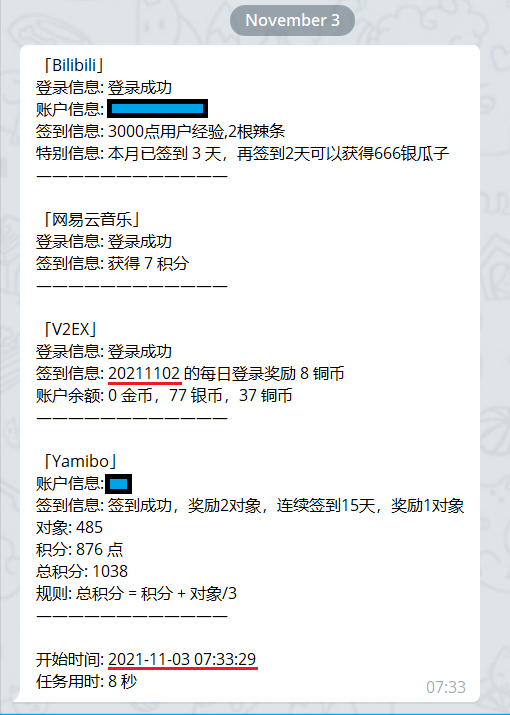
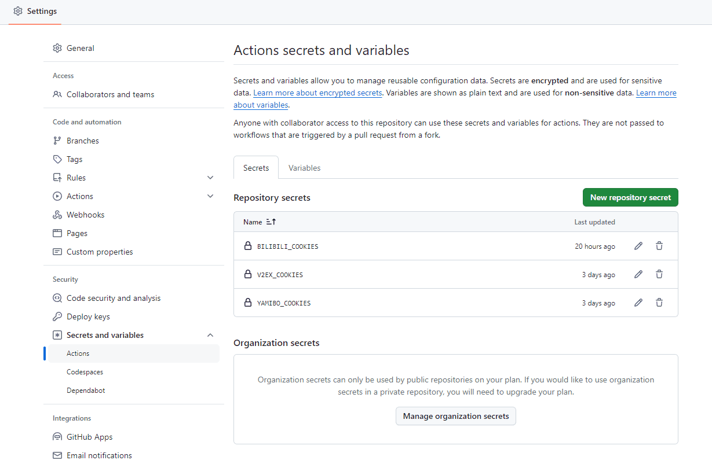
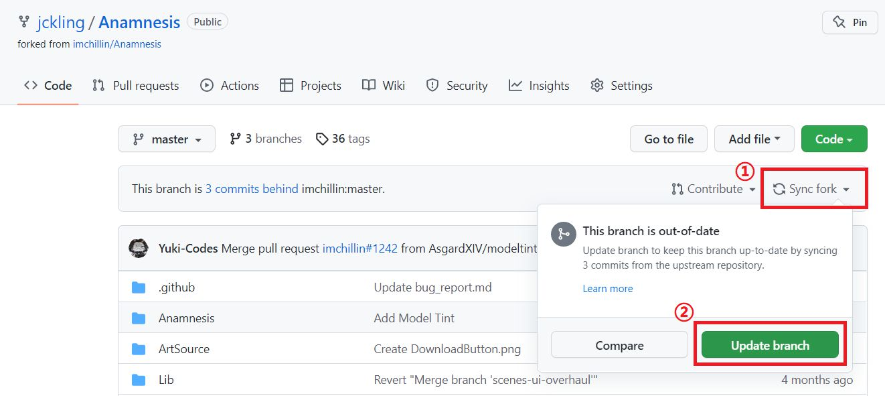
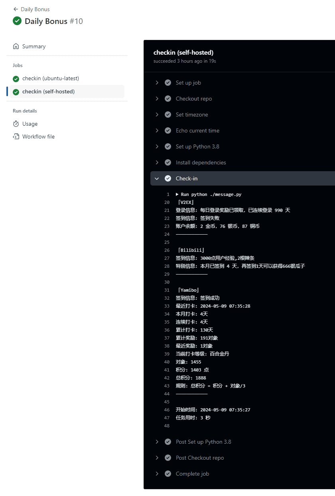
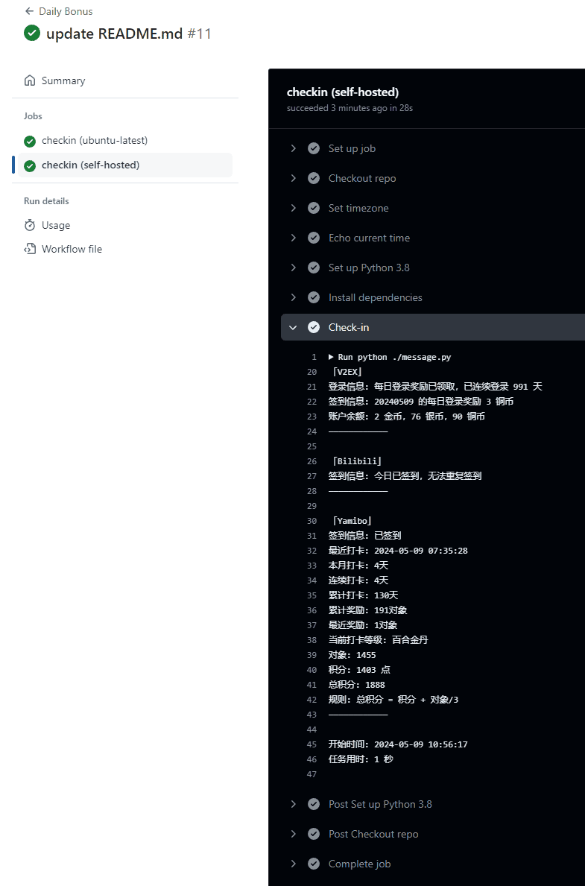
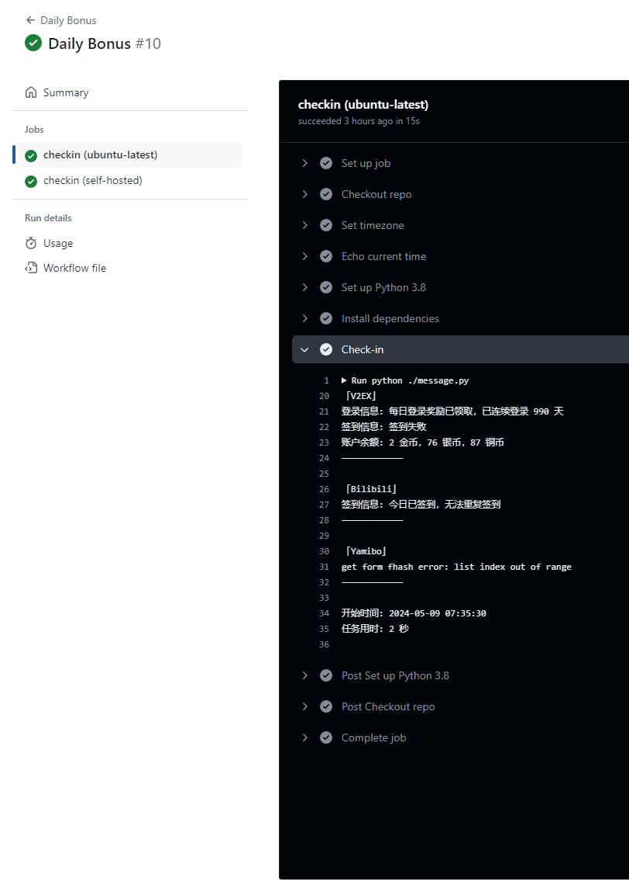

# Daily-Bonus

    
    
    

使用 Github Action 签到，用哪个就配置相应的环境变量，默认输出到控制台，支持 Telegram 消息推送。

## 说明

实现功能

- [x] v2ex （铜币）
    - 如果使用默认的 Github Action Runner，由于时区不同，定时任务签的是**昨天**
- [x] bilibili 直播（辣条）
- [x] yamibo 论坛（对象）
- [x] yurifans 论坛（积分）
- [x] telegram-bot 推送
- [ ] ff14 （积分）【修复中】
- [ ] 哔咔漫画打卡（哔咔）【未验证】

Telegram 推送签到结果

## 使用方式

0. 右上角 **star** 本仓库（可选/支持）
1. 右上角 **fork** 本仓库
2. 添加环境变量：Settings - Secrets and variables - Actions - New repository secret
3. 修改 .github/workflows/checkin.yml： 删除 `self-hosted` 并提交
4. 北京时间每天早上 7:30 定时运行，或仓库 master 分支有提交时触发

| 内容              | 说明                                                      | 备注                                                                                                                 |
|-----------------|---------------------------------------------------------|--------------------------------------------------------------------------------------------------------------------|
| secret          | 添加之后可以更新值，但看不到之前设置的值，且不能修改名称                            |                                                                                        |
| `self-hosted`   | 将自己的机器注册为 runner                                        | 参照 [Hosting your own runners - GitHub Docs](https://docs.github.com/en/actions/hosting-your-own-runners)           |
| `ubuntu-latest` | 使用 github 提供的 runner                                    | 参照 [Using GitHub-hosted runners - GitHub Docs](https://docs.github.com/en/actions/using-github-hosted-runners)  |
| 更新              | 打开自己的仓库页面，点击 `Sync fork - Update branch` 即可，注意更新会触发一次签到 |                                                                                         |

**注意**

1. 300 论坛使用 github runner 签到时会遇到 cloudflare 人机验证
2. 签到失败可以在 Action 页面尝试 `Re-run`，例如 5.8 已手动完成 v2ex 签到，5.9 定时运行签到昨天显示失败，手动触发重新运行签到成功

| runner          | 定时运行                                      | 手动触发                                    |
|-----------------|-------------------------------------------|-----------------------------------------|
| `self-hosted`   |  |  |
| `ubuntu-latest` |       |      |

## 配置

### Telegram 推送

| Name         | Description | How to                                                                                                                                                                                                      |
|--------------|-------------|-------------------------------------------------------------------------------------------------------------------------------------------------------------------------------------------------------------|
| TG_BOT_TOKEN | bot token   | [How Do I Create a Bot?](https://core.telegram.org/bots#how-do-i-create-a-bot)                                                                                                                              |
| TG_USER_ID   | user id     | [How can I send a message to someone with my telegram bot using their Username](https://stackoverflow.com/questions/41664810/how-can-i-send-a-message-to-someone-with-my-telegram-bot-using-their-username) |

### V2EX

V2EX 论坛使用 Cookie 登录

| Name         | Description |
|--------------|-------------|
| V2EX_COOKIES | Cookie      |

### Bilibili

bilibili 直播使用 Cookie 登录

| Name             | Description |
|------------------|-------------|
| BILIBILI_COOKIES | Cookie      |

### Yamibo

300 论坛使用 Cookie 登录

| Name           | Description |
|----------------|-------------|
| YAMIBO_COOKIES | Cookie      |

### Yurifans

Yurifans 使用邮箱和密码登录

| Name              | Description |
|-------------------|-------------|
| YURIFANS_EMAIL    | 邮箱          |
| YURIFANS_PASSWORD | 密码          |

### FFXIV【修复中】

FF14 积分商城使用账号和密码登录

| Name              | Description |
|-------------------|-------------|
| FFIXV_USERNAME    | 账号          |
| FFIXV_PASSWORD    | 密码          |
| FFXIV_AREA_NAME   | 大区名         |
| FFXIV_SERVER_NAME | 服务器名        |
| FFXIV_ROLE_NAME   | 角色名         |

### Picacomic【未验证】

哔咔漫画使用账号（邮箱/用户名）和密码登录

| Name          | Description |
|---------------|-------------|
| PICA_EMAIL    | 邮箱或用户名      |
| PICA_PASSWORD | 密码          |

## 许可证

[MIT](https://github.com/jckling/Daily-Bonus/blob/master/LICENSE)

## 其他

开发工具

- Fiddler 4
- Python 3.8.5
- GitHub Actions

参阅

- [构建和测试 Python](https://docs.github.com/cn/actions/guides/building-and-testing-python)
- [为用户帐户仓库创建密码](https://docs.github.com/cn/actions/reference/encrypted-secrets#creating-encrypted-secrets-for-a-repository)
- [mengshouer/CheckinBox](https://github.com/mengshouer/CheckinBox)
- [Github Action use existing Python script and get String output](https://stackoverflow.com/questions/61656704/github-action-use-existing-python-script-and-get-string-output)
- [Workflow commands for GitHub Actions](https://docs.github.com/en/actions/learn-github-actions/workflow-commands-for-github-actions)
- [niuhuan/pica-go](https://github.com/niuhuan/pica-go)
- [Sitoi/dailycheckin](https://github.com/Sitoi/dailycheckin)
