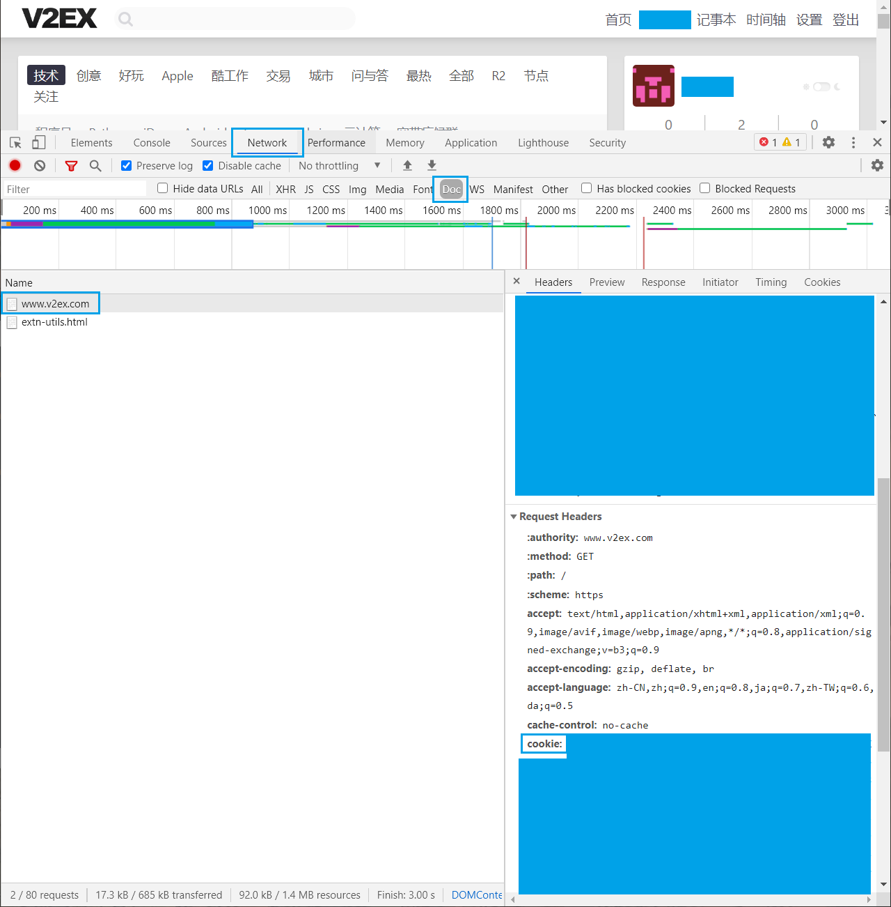

# Daily-Bonus

## TODO

- [x] bilibili 直播（辣条）
- [x] yamibo 论坛（对象）
- [x] 网易云手机端（云贝）
- [x] v2ex （铜币）
- [ ] ff14 （积分）
- [ ] 百度贴吧（）

PS：V2EX 签到可用插件 [V2EX plus](https://github.com/sciooga/v2ex-plus)

## Tools

- Fiddler 4
- Python 3.8.5
- GitHub Actions

## GitHub Actions

1. Fork 本仓库
2. 新建环境：Settings - Environments - New environment - 新建 checkin_environment
3. 环境变量：Settings - Environments - Environment secrets - Add Secret

添加 Secrets 之后可以更新值，但不能修改名称。

### FFXIV

FF14 积分商城签到使用账号密码登录。

| Name              | Description |
| ----------------- | ----------- |
| FFIXV_USERNAME    | 账号        |
| FFIXV_PASSWORD    | 密码        |
| FFXIV_AREA_NAME   | 大区名      |
| FFXIV_SERVER_NAME | 服务器名    |
| FFXIV_ROLE_NAME   | 角色名      |

### NetEase Cloud Music

网易云签到使用手机号和密码登录。

| Name            | Description |
| --------------- | ----------- |
| MUSIC_CELLPHONE | 手机号      |
| MUSIC_PASSWORD  | 密码        |

### V2EX

V2EX 论坛使用 Cookie 登录，目前每 **2 周** 需要更换一次。

| Name         | Description |
| ------------ | ----------- |
| V2EX_COOKIES | Cookie      |

登录 v2ex 后，使用开发者工具查看 Cookie ，右键复制即可

- Chrome：F12 - Network - F5 - Doc - www.v2ex.com - Headers - Request Headers - cookie

### Bilibili

bilibili 直播间使用 Cookie 登录。

| Name             | Description |
| ---------------- | ----------- |
| BILIBILI_COOKIES | Cookie      |

### Yamibo

300 论坛使用 Cookie 登录。

| Name           | Description |
| -------------- | ----------- |
| YAMIBO_COOKIES | Cookie      |

## 参阅

- [构建和测试 Python](https://docs.github.com/cn/actions/guides/building-and-testing-python)
- [为用户帐户仓库创建密码](https://docs.github.com/cn/actions/reference/encrypted-secrets#creating-encrypted-secrets-for-a-repository)
- [mengshouer/CheckinBox](https://github.com/mengshouer/CheckinBox)