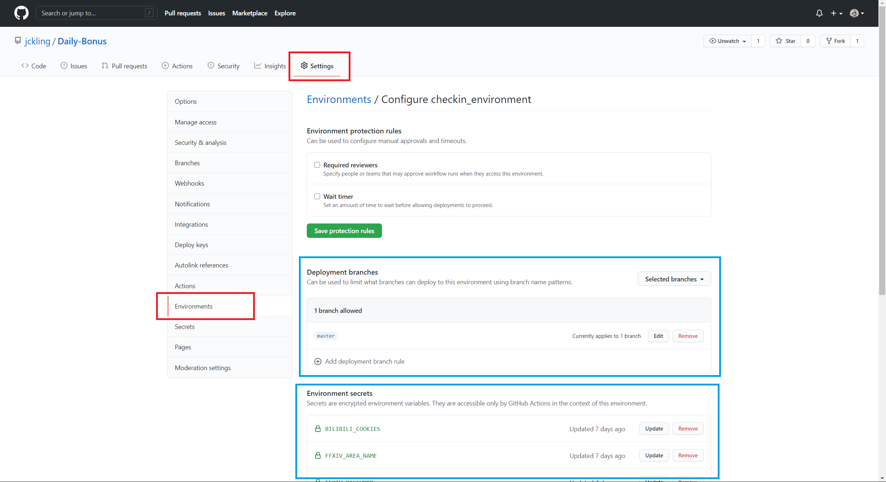
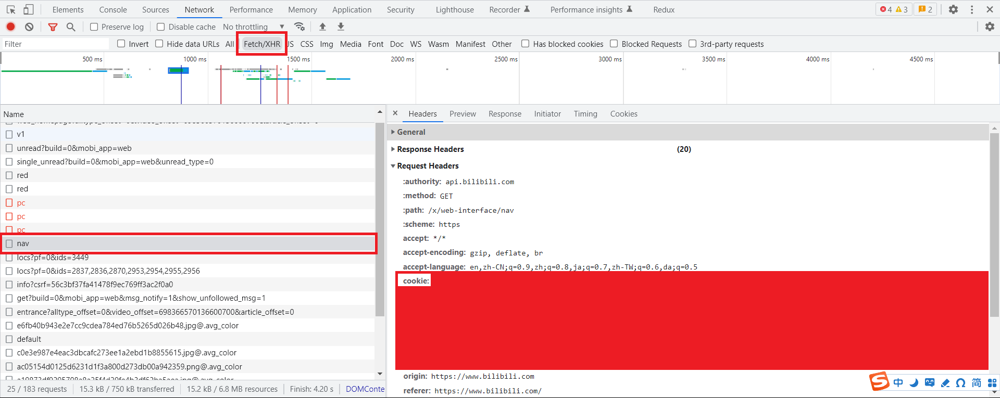

# Daily-Bonus

[dev](https://github.com/jckling/Daily-Bonus/tree/dev) 分支：使用腾讯云函数实现多种签到，基于 [Sitoi/dailycheckin](https://github.com/Sitoi/dailycheckin) 修改，支持多种消息推送。

[master](https://github.com/jckling/Daily-Bonus/tree/master) 分支：使用 Github Action 签到，用哪个就配置相应的环境变量，默认输出到控制台。

## 说明

实现功能
- [x] bilibili 直播（辣条）
- [x] yamibo 论坛（对象）
- [x] ~~网易云手机端（云贝）~~【已失效】
- [x] v2ex （铜币）
  - 由于 Github Action 的时区不同，签的是昨天
- [x] ff14 （积分）
  - 使用 dev 分支 + 腾讯云函数部署
- [x] telegram-bot 推送
- [ ] 哔咔漫画打卡（哔咔）

开发工具
- Fiddler 4
- Python 3.8.5
- GitHub Actions

Telegram 推送签到结果

## GitHub Actions

0. 右上角点个 star
1. 右上角 fork 本仓库
2. 在克隆的仓库中添加环境变量：Actions - New repository secret
3. 每天早上 7:30 开始运行

添加 Secrets 之后可以更新值，但不能修改名称。

### Telegram 推送

| Name              | Description |
| ----------------- | ----------- |
| TG_USER_ID        | 用户 id      |
| TG_BOT_TOKEN      | bot token   |

用户 id 的获取方式可以看这个：[How can I send a message to someone with my telegram bot using their Username](https://stackoverflow.com/questions/41664810/how-can-i-send-a-message-to-someone-with-my-telegram-bot-using-their-username)

### FFXIV

FF14 积分商城使用账号和密码登录。**请使用 dev 分支 + 腾讯云函数部署**，使用 Github Action 登录时 IP 显示在美国，容易遇到验证码。

| Name              | Description |
| ----------------- | ----------- |
| FFIXV_USERNAME    | 账号        |
| FFIXV_PASSWORD    | 密码        |
| FFXIV_AREA_NAME   | 大区名      |
| FFXIV_SERVER_NAME | 服务器名    |
| FFXIV_ROLE_NAME   | 角色名      |

### NetEase Cloud Music

网易云音乐使用手机号和密码登录。

| Name            | Description |
| --------------- | ----------- |
| MUSIC_CELLPHONE | 手机号      |
| MUSIC_PASSWORD  | 密码        |

### V2EX

V2EX 论坛使用 Cookie 登录，目前每 **2 周** 需要更换一次。

| Name         | Description |
| ------------ | ----------- |
| V2EX_COOKIES | Cookie      |

登录 v2ex 后，使用开发者工具查看 Cookie

- Chrome：F12 - Network - F5 - Doc - www.v2ex.com - Headers - Request Headers - cookie
- 删除 Cookie 中的 ip 信息：例如 `EeqY_2132_lip=111.111.111.111%2C1661066680;`

### Bilibili

bilibili 直播间使用 Cookie 登录，添加了 Cookie 自动更新。

| Name             | Description |
| ---------------- | ----------- |
| SESSDATA         | 从cookie获取 |
| buvid3           | 从cookie获取 |
| bili_jct         | 从cookie获取 |
| DedeUserID       | 从cookie获取 |

登录 https://www.bilibili.com/ 后，使用开发者工具查看 Cookie

- Chrome：F12 - Network - F5 - Fetch/XHR - nav - Headers - Request Headers - cookie

### Yamibo

300 论坛使用 Cookie 登录。

| Name           | Description |
| -------------- | ----------- |
| YAMIBO_COOKIES | Cookie      |

### Picacomic

哔咔漫画使用账号（邮箱/用户名）和密码登录。

| Name          | Description |
|---------------|-------------|
| PICA_EMAIL    | 邮箱或用户名 |
| PICA_PASSWORD | 密码        |

## 参阅

- [构建和测试 Python](https://docs.github.com/cn/actions/guides/building-and-testing-python)
- [为用户帐户仓库创建密码](https://docs.github.com/cn/actions/reference/encrypted-secrets#creating-encrypted-secrets-for-a-repository)
- [mengshouer/CheckinBox](https://github.com/mengshouer/CheckinBox)
- [Github Action use existing Python script and get String output](https://stackoverflow.com/questions/61656704/github-action-use-existing-python-script-and-get-string-output)
- [Workflow commands for GitHub Actions](https://docs.github.com/en/actions/learn-github-actions/workflow-commands-for-github-actions)
- [niuhuan/pica-go](https://github.com/niuhuan/pica-go)
