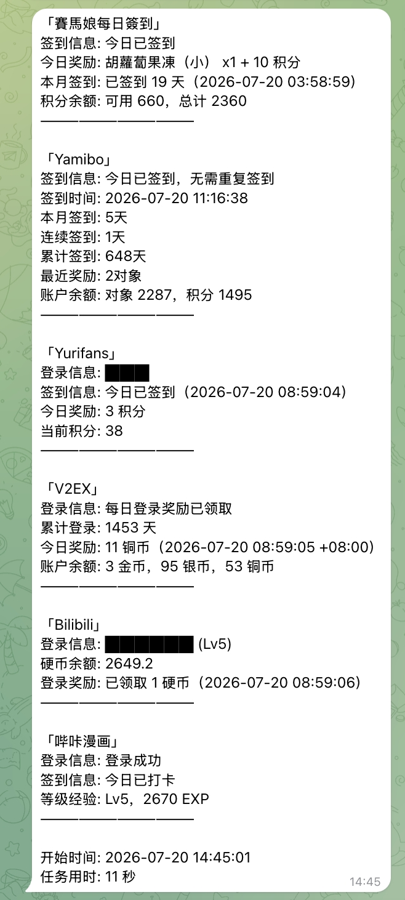
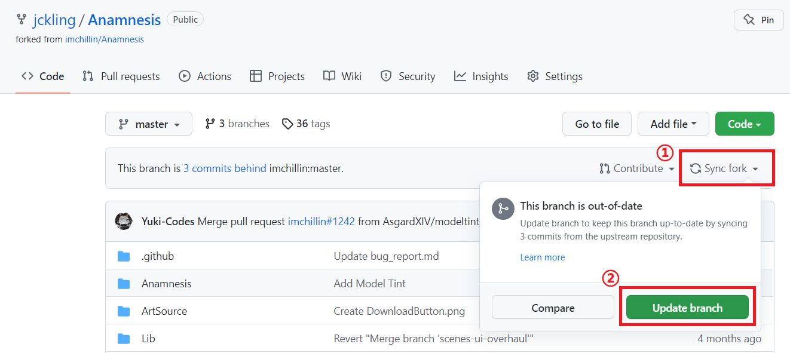
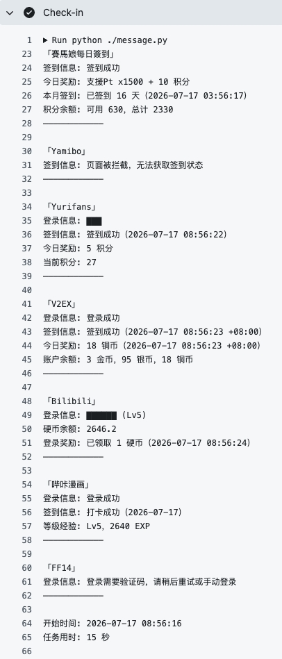
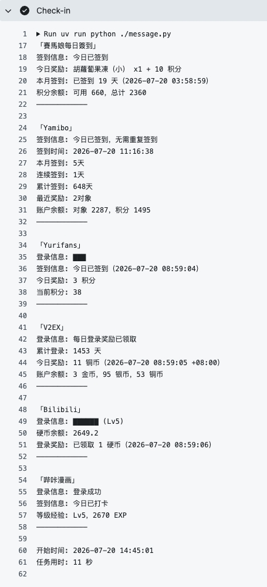

# Daily-Bonus

<p>
    <a href="https://github.com/jckling/Daily-Bonus/stargazers"></a>
    <a href="https://github.com/jckling/Daily-Bonus/network/members"></a>
    <a href="https://github.com/jckling/Daily-Bonus/issues"></a>
</p>

自动签到脚本，通过 GitHub Actions 定时执行，支持 Telegram 推送签到结果。

> 如果觉得有用，右上角点个 ⭐ Star 支持一下，感谢！

## 功能

| 站点 | 方式 | 奖励 |
|------|------|------|
| V2EX | Cookie | 铜币 |
| Bilibili | Cookie | 硬币 |
| Yamibo（百合会 / 300） | Cookie | 对象 |
| Yurifans | 账号密码 | 积分 |
| 赛马娘 | Cookie | 游戏内道具 + 积分 |
| 哔咔漫画 | 账号密码 | 经验 |
| ~~FF14 商城~~ | ~~账号密码~~ | ~~积分~~ |

> ⚠️ **FF14 商城签到已废弃**。SDO 登录接口接入了 Geetest 风控，脚本登录会触发滑块验证码，无法自动绕过。

Telegram 推送：



## 快速开始

1. **Fork** 本仓库
2. 添加环境变量：Settings → Secrets and variables → Actions → New repository secret
3. 默认使用 GitHub-hosted runner（`ubuntu-latest`），北京时间每天 07:30 自动运行

更新：打开自己 fork 的仓库，点击 `Sync fork → Update branch` 即可同步



签到结果示例：

| GitHub-hosted | Self-hosted |
|---------------|-------------|
|  |  |

## Runner 说明

项目提供两个 workflow 文件：

| 文件 | Runner | 说明 |
|------|--------|------|
| `checkin.yml` | `ubuntu-latest` | fork 直接使用，无需额外配置 |
| `checkin-self-hosted.yml` | `self-hosted` | 需自建 runner，纯 shell 步骤不依赖 action 下载 |

### GitHub-hosted（`ubuntu-latest`）

Fork 后开箱即用。Yamibo 论坛有 Cloudflare 防护，GitHub 数据中心 IP 会被 WAF 拦截，建议自建 runner 或本地定时运行。

### Self-hosted

适合需要本地网络环境的场景（例如 Yamibo 签到），使用 [myoung34/docker-github-actions-runner](https://github.com/myoung34/docker-github-actions-runner) 在本地启动 runner：

```bash
docker run -d \
  --name github-runner \
  --net=host \
  --platform linux/amd64 \
  --restart unless-stopped \
  -e ACCESS_TOKEN="<PAT>" \
  -e DEBUG_OUTPUT="true" \
  -e LABELS="self-hosted,linux" \
  -e REPO_URL="https://github.com/jckling/Daily-Bonus" \
  -e RUN_AS_ROOT="true" \
  -e RUNNER_NAME="local-runner" \
  -v /var/run/docker.sock:/var/run/docker.sock \
  -v runner_work:/_work \
  myoung34/github-runner:latest
```

需要修改的参数：

- `ACCESS_TOKEN`：GitHub Personal Access Token
- `REPO_URL`：fork 的仓库地址

### 问题排查

**Self-hosted runner 卡住没有日志**

检查容器能否连接 `launch.actions.githubusercontent.com`，国内网络可能无法直连。`checkin-self-hosted.yml` 已改为纯 shell 步骤（`git clone` + `curl`），不依赖 external action 下载。如仍有问题，给容器配置代理或使用 `--net=host`。

**Yamibo 签到提示「页面被拦截」**

Yamibo 启用了 Cloudflare JS Challenge，检测 TLS 指纹。GitHub-hosted runner（美国 IP）和 ARM64 self-hosted runner 均会被拦截。解决方案：使用 x86_64 模式的 self-hosted runner，或本地 crontab 运行。

**签到失败**

在 Actions 页面点击 `Re-run` 重新运行即可。Cookie 可能过期，重新获取后更新 Secrets。

## 配置

在仓库 Settings → Secrets → Actions 中添加以下环境变量，按需配置：

### Telegram 推送

| Name | Description |
|------|-------------|
| TG_BOT_TOKEN | Bot Token，参考 [How Do I Create a Bot?](https://core.telegram.org/bots#how-do-i-create-a-bot) |
| TG_USER_ID | 用户 ID，参考 [How can I send a message to someone with my telegram bot using their Username](https://stackoverflow.com/questions/41664810) |

### 赛马娘网页签到

使用 Cookie 登录，需要 `site`、`joy_jct`、`DedeUserID`、`SESSDATA`

| Name | Description |
|------|-------------|
| UMA_COOKIES | Cookie |

### V2EX

使用 Cookie 登录，需要 `PB3_SESSION`、`A2`、`V2EX_LANG`、`V2EX_TAB`

| Name | Description |
|------|-------------|
| V2EX_COOKIES | Cookie |

### Yamibo

使用 Cookie 登录，需要 `EeqY_2132_auth`、`EeqY_2132_saltkey`

| Name | Description |
|------|-------------|
| YAMIBO_COOKIES | Cookie |

### Yurifans

| Name | Description |
|------|-------------|
| YURIFANS_EMAIL | 邮箱 |
| YURIFANS_PASSWORD | 密码 |

### Bilibili

使用 Cookie 登录，需要 `SESSDATA`、`DedeUserID`

| Name | Description |
|------|-------------|
| BILIBILI_COOKIES | Cookie |

### 哔咔漫画

| Name | Description |
|------|-------------|
| PICA_USERNAME | 用户名或邮箱 |
| PICA_PASSWORD | 密码 |

## 开发环境

- macOS (Apple Silicon, ARM64)
- Python 3.13
- [curl_cffi](https://github.com/lexiforest/curl_cffi)（TLS 指纹伪装）
- Chrome DevTools / HAR 抓包

## 致谢

- [ewigl/picacg-auto-checkin](https://github.com/ewigl/picacg-auto-checkin)
- [Sitoi/dailycheckin](https://github.com/Sitoi/dailycheckin)
- [myoung34/docker-github-actions-runner](https://github.com/myoung34/docker-github-actions-runner)
- [astral-sh/uv](https://github.com/astral-sh/uv)

## 许可证

[MIT](LICENSE)
